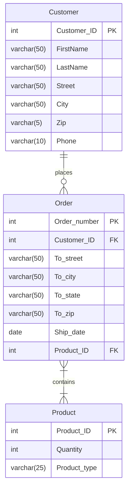

This is an extension of my [2025 Learning Log](). 

I've reviewed ERDs (Entity Relation Diagrams) and Mermaid - a tool to create diagrams using code.

References:  
(Then and now, I find the Lucid chart explanations of ERD to be a good resource on this)
- [Entity Relationship Diagram (ERD) Tutorial - Part 1 ](https://www.youtube.com/watch?v=xsg9BDiwiJE&t=25s)
- [ Entity Relationship Diagram (ERD) Tutorial - Part 2 ](https://www.youtube.com/watch?v=hktyW5Lp0Vo)


### ERD

Entity Relationship Diagram (ERD)
- provides a visual way to understand how information in a database are related
- enables visualization and idealization before actually building a database

Components
- Entity - an object (person, place, or thing) that's tracked in the database (rows)
- Attributes - Properties or traits of an entity (columns)
- Relationship - Describes how entities interact with each other
- Cardinalities - Help define the relationship in numerical context; particularly in minimums and maximums

<center></center>
  
Primary key
- An attribute or field that uniquely identifies every record within a certain table
- Only one PK per Entity
- Rules
    - Has to be unique and identify with only one record in the table
    - Needs to be never changing (e.g. name, street can change for a User entity but userId does not)
    - Needs to be never null

Foreign Key
- The same as a primary key but located in another Entity
- Used to better understand how Entities related to one another
- Rules
    - Unlike a PK, an FK does not have to be unique. It can be repeated inside a table.
    - It's possible to have multiple FKs in one Entity

Composite Primary Key
- Used when two or more attributes are necessary to uniquely identify every record in a table
- Rules
    - Use the fewest number of attributes as possible
    - Don't use attributes that are apt to change
- Alternatively, a new Entity ID can also be created and used in lieu of composite PK but ultimately it depends on how the database is designed and if there's a scenario when composite PKs make more sense

Bridge Tables
- "Is there anything else that should be recorded into the database?"
- Usually used to break many to many relationships
- Example: Order breaks up the relationship between Customer and Product

<center></center>


### Mermaid

[Mermaid](https://mermaid.js.org) enables diagrams to be built as code. The tool can create a myriad of charts such as flowcharts, class diagrams, mind maps and even Gantt charts. 

It is also able to [build ERDs](https://mermaid.js.org/syntax/entityRelationshipDiagram.html).
It can represent the Entities and their Relationships with corresponding Cardinalities, as well as Attributes, and Keys. Other features include being able to add  comments, and use aliasing.

So as an exercise, writing the example from the Lucid Chart video as Mermaid, the code would look like this


```markdown
erDiagram

    c[Customer] {
        int Customer_ID PK
        varchar(50) FirstName
        varchar(50) LastName
        varchar(50) Street
        varchar(50) City
        varchar(5) Zip
        varchar(10) Phone
    }

    o[Order] {
        int Order_number PK
        int Customer_ID FK
        varchar(50) To_street
        varchar(50) To_city
        varchar(50) To_state
        varchar(50) To_zip
        date Ship_date
        int Product_ID FK
    }

    p[Product] {
        int Product_ID PK
        int Quantity
        varchar(25) Product_type
    }

    c ||--o{ o : places
    o }|--|{ p : contains

```

And the chart will render like this



Some observations while trying Mermaid out: 
- Seems like relationship description is a required field
- Once a column already contains a type, the rest should have types too.
- I also encountered an interesting error while I was trying Mermaid in another model: [`u` can't be used as alias](https://github.com/mermaid-js/mermaid/issues/5093). To get around this, use quotes `"u"`
