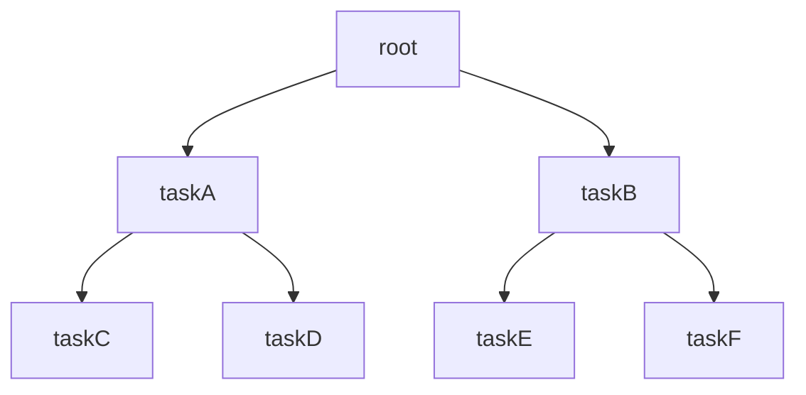
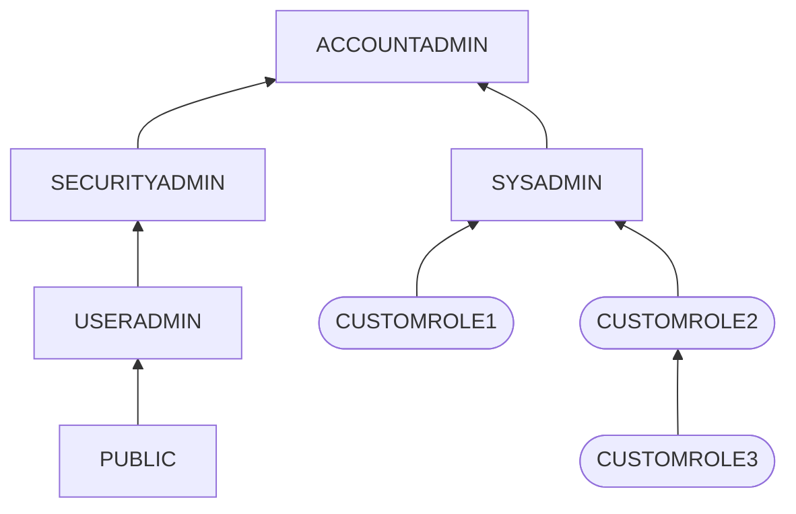

I've recently studied Snowflake through this course: [Snowflake masterclass](https://www.udemy.com/course/snowflake-masterclass). Here's my [certificate](https://www.udemy.com/certificate/UC-815019cf-596a-4b6c-8b1a-9c3f5138eeba). This course covered a lot of topics, and it's been a fulfilling couple of weeks learning the ins and outs of this tool.

Here are some of my notes and ideas I've learned. This is a part of my learning goals for this year, which I've written about here: [learning log for this year (2025)]()

## Setup, architecture overview, loading data

Taking a step towards my goals this year, I've started doing a deep-dive into Snowflake through learning about it in this course [Snowflake Masterclass](https://www.udemy.com/course/snowflake-masterclass/).

Today, I've setup a Business critical Snowflake account with AWS, had a tour of the interface, and created a virtual warehouse, database, and schema using both the UI and SQL. I've also created a table, and loaded data from S3 bucket. 

There were two assignments:
- For the first one, I've created a virtual warehouse using SQL with a custom auto suspend time specified
- For the second one, I've created a new database and table, and loaded a customers CSV file from S3 bucket into that table.

My main learnings for today are:
- Snowflake consists of **3 layers**: Storage, Query Processing, and Cloud Services
- **Warehouse sizes** are from XS to 6XL, each consisting of increasing number of servers, and costing increasing number of credits per hour; increase the size based on the amount of compute required e.g. for complex computations
- **Multi-clustering** consists of more than one size in a cluster (e.g. S-S-S); increase cluster size based on the workload e.g. increased number of queries or users
- Cost is base on **credits** spent. Each credit cost in money depends on the cloud provider and region. Credits get spent on the uptime and number of servers.

## Editions, pricing and cost monitoring, roles

The different [Snowflake editions](https://docs.snowflake.com/en/user-guide/intro-editions) are:
- Standard
- Enterprise
- Business-Critical
- Virtual Private

which have increasing data security, time travel days, failover support, but also cost. Virtual Private is an edition that needs to be coordinated directly with Snowflake. 

For [Pricing](https://www.snowflake.com/en/data-cloud/pricing-options/), it can be broken down into Compute, Storage, and Data transfer costs. There is also a Cloud Service cost for behind the scene cloud tasks. This is usually minimal and only charged if the Cloud service exceeds 10% of the warehouse consumption. Data transfer is charged at egress, ingress is free (which is usually the case for cloud providers).

The Snowflake UI has a Cost Management page accessible to the ACCOUNTADMIN. In it, there is a Resource Monitor feature wherein a quota per cycle (e.g. 10 credits per month) can be set. Actions can be taken depending on the percentage of quota consumed which can exceed 100%. Actions include: 1) notify, 2) suspend and notify (which waits for queries to finish before suspending), and 3) suspend immediately and notify. 

Lastly, the different [Roles](https://docs.snowflake.com/en/user-guide/security-access-control-overview) were discussed and their respective resposiblities
- ORGADMIN - manages multiple accounts
- ACCOUNTADMIN - manages all objects in the account
- SECURITYADMIN - manages grant privileges
- SYSADMIN - creates warehouses, databases, and other objects, and grants privileges on them
- USERADMIN - user and role management
- PUBLIC - automatically granted to new users by default
- Custom - assigned under SYSADMIN so the latter can manage the objects created by Custom

## COPY command, transformation, file format object

There are two main methods of loading data into Snowflake:
- Bulk - most frequent method; uses warehouse, COPY command
- Continuous - for small volumes of data; automatic once data is added to stage; Snowpipe (serverless feature)

Stages are objects in Snowflake that pertain to the location of data files. Not to be confused with staging tables in data warehouses.

There are two types of Stages
- External - from cloud provider
- Internal - from Snowflake-managed location


Example of Stage
```sql
-- Create external stage
CREATE OR REPLACE STAGE MANAGE_DB.external_stages.aws_stage
    url='s3://somefilefolder'
    credentials=(aws_key_id='ABCD_DUMMY_ID' aws_secret_key='1234abcd_key');

-- Describe properties
DESC STAGE MANAGE_DB.external_stages.aws_stage; 

-- List files in stage
LIST @aws_stage
```

Example of COPY command
```sql
COPY INTO DB_NAME.PUBLIC.ORDERS
    FROM @MANAGE_DB.external_stages.aws_stage
    file_format= (type = csv field_delimiter=',' skip_header=1)
    pattern='.*Order.*';

-- Error handling using the ON_ERROR
COPY INTO DB_NAME.PUBLIC.ORDERS_EX
    FROM @MANAGE_DB.external_stages.aws_stage_errorex
    file_format= (type = csv field_delimiter=',' skip_header=1)
    files = ('OrderDetails_error.csv','OrderDetails_error2.csv')
    ON_ERROR = 'SKIP_FILE';

-- ON_ERROR = { CONTINUE | SKIP_FILE | SKIP_FILE_<num> | 'SKIP_FILE_<num>%' | ABORT_STATEMENT }
```

Example of Transformation
```sql
COPY INTO DB_NAME.PUBLIC.ORDERS_EX
    FROM (select 
            s.$1,
            s.$2, 
            s.$3,
            CASE WHEN CAST(s.$3 as int) < 0 THEN 'not profitable' ELSE 'profitable' END 
          from @MANAGE_DB.external_stages.aws_stage s)
    file_format= (type = csv field_delimiter=',' skip_header=1)
    files=('OrderDetails.csv');
```


Example of file format
```sql
CREATE OR REPLACE file format my_file_format
    TYPE=CSV
    FIELD_DELIMITER = '|'
    SKIP_HEADER = 1;

--Describe file format
DESC FILE FORMAT my_file_format;

--Using file format object in Copy command       
COPY INTO CUSTOMERS
    FROM @aws_stage
    file_format= (FORMAT_NAME= EXERCISE_DB.PUBLIC.my_file_format);

```

## Copy options, rejected records, load history

Copy options modify the behaviour of the `COPY INTO` command

General form:
```sql
COPY INTO TABLE_NAME
FROM @STAGE_NAME
FILE = 'file_name1', ...
CopyOptions
```


`VALIDATION_MODE`
- validates the data files before loading them
```sql
VALIDATION_MODE = RETURN_n_ROWS | RETURN_ERRORS
```

`SIZE_LIMIT`
- Specifies the maximum size (in bytes) of data loaded in the command 
- Combined file sizes of all files
- Will load first file regardless; the next file will be loaded until limit is reached (can exceed limit on last file); next file after the limit will not be loaded

```sql
SIZE_LIMIT = num
```

`RETURN_FAILED_ONLY`
- Specifies whether to return only files that have failed to load in the statement result

```sql
RETURN_FAILED_ONLY = TRUE | FALSE
```

`TRUNCATECOLUMNS`
- Specifies whether to truncate text strings that exceed the target column length
- `TRUE` - strings are automatically truncated to the target column length
- `FALSE` - COPY produces an error if a loaded string exceeds the target column length

```SQL
TRUNCATECOLUMNS = TRUE | FALSE
```

`FORCE`
- Specifies to load all files, regardless of whether they've been loaded previously and have not changed since they were loaded
- Note that this option reloads files, potentially duplicating data in a table

```SQL
FORCE = TRUE | FALSE
```

Rejected records can be queried, further processed, and saved to a table


```sql

---- 1) With VALIDATION_MODE ---- 

COPY INTO COPY_DB.PUBLIC.ORDERS
    FROM @aws_stage_copy
    file_format= (type = csv field_delimiter=',' skip_header=1)
    pattern='.*Order.*'
    VALIDATION_MODE = RETURN_ERRORS;

-- Storing rejected /failed results in a table
CREATE OR REPLACE TABLE rejected AS 
select rejected_record from table(result_scan(last_query_id()));

select rejected_record from table(result_scan('01ba740e-030c-57ce-000b-8ec3000360e2')); 

SELECT * FROM REJECTED;

---- 2) Without VALIDATION_MODE ---- 

COPY INTO COPY_DB.PUBLIC.ORDERS
    FROM @aws_stage_copy
    file_format= (type = csv field_delimiter=',' skip_header=1)
    pattern='.*Order.*'
    ON_ERROR=CONTINUE;
  
  
select * from table(validate(orders, job_id => '_last'));


--- can be processed further

SELECT REJECTED_RECORD FROM rejected;

CREATE OR REPLACE TABLE rejected_values as
SELECT 
SPLIT_PART(rejected_record,',',1) as ORDER_ID, 
SPLIT_PART(rejected_record,',',2) as AMOUNT, 
SPLIT_PART(rejected_record,',',3) as PROFIT, 
SPLIT_PART(rejected_record,',',4) as QUATNTITY, 
SPLIT_PART(rejected_record,',',5) as CATEGORY, 
SPLIT_PART(rejected_record,',',6) as SUBCATEGORY
FROM rejected; 


```


Load history can be queried from database view or from `snowflake` database

```sql
-- Query load history within a database --
USE COPY_DB;

SELECT * FROM information_schema.load_history;


-- Query load history gloabally from SNOWFLAKE database --
SELECT * FROM snowflake.account_usage.load_history;

```

## Loading unstructured data into Snowflake

Steps to load unstructured data (such as JSON or Parquet) into Snowflake:
- Create stage, define file format
- Load raw data (type `VARIANT` can handle all kinds of unstructured data)
- Analyse & Parse
- Flatten & Load

### Load JSON files

To load JSON file(s) into a Raw Table, create a stage, define a JSON file format, create a raw data table, then copy the raw JSON into the raw data table 

```sql
USE DB_NAME.SCHEMA_NAME;

-- Load Raw JSON

CREATE OR REPLACE stage JSONSTAGE
     url='s3://somejsonfiles';

LIST @JSONSTAGE;

CREATE OR REPLACE FILE FORMAT JSONFORMAT
    TYPE = JSON;


-- Create table containing one column with type Variant
CREATE OR REPLACE TABLE JSON_RAW (
    RAW_FILE VARIANT
);
    
-- Load staged JSON file into table using COPY command
COPY INTO JSON_RAW
    FROM @JSONSTAGE
    file_format= JSONFORMAT
    files = ('data.json');
    
   
SELECT * FROM JSON_RAW;
```

Parse the raw JSON data using colon notation (`:`). Cast to type using double colons (`::`). Arrays are indexed from 0. JSON keys are case-sensitive (otherwise the result is `null` when keys are not found).

```sql
SELECT 
    RAW_FILE:id::int as id,  
    RAW_FILE:first_name::STRING as first_name,
    RAW_FILE:last_name::STRING as last_name,
    RAW_FILE:gender::STRING as gender
    -- nested data
    RAW_FILE:job.salary::INT as salary,
    RAW_FILE:job.title::STRING as title
    -- array
    RAW_FILE:prev_company[0]::STRING as prev_company
FROM JSON_RAW;
```

Use `TABLE()` function to flatten hierarchical data

```sql
select
    RAW_FILE:first_name::STRING as First_name,
    f.value:language::STRING as "Language",
    f.value:level::STRING as Level_spoken
from JSON_RAW, 
table(flatten(RAW_FILE:spoken_languages)) f;
```

To load into a table, use `CREATE TABLE AS` OR `INSERT INTO`

```sql
-- Create table
CREATE OR REPLACE TABLE Languages AS
select
    RAW_FILE:first_name::STRING as First_name,
    f.value:language::STRING as "Language",
    f.value:level::STRING as Level_spoken
from JSON_RAW, 
table(flatten(RAW_FILE:spoken_languages)) f;

-- Insert into. Table needs to be created before hand
INSERT INTO Languages
select
    RAW_FILE:first_name::STRING as First_name,
    f.value:language::STRING as "Language",
    f.value:level::STRING as Level_spoken
from JSON_RAW, 
table(flatten(RAW_FILE:spoken_languages)) f;

```

### Load Parquet files

Parquet files can be loaded from Stage

Create a stage and Parquet file format

```sql
-- Create file format and stage object
    
CREATE OR REPLACE FILE FORMAT PARQUET_FORMAT
    TYPE = 'parquet';

CREATE OR REPLACE PARQUETSTAGE
    url = 's3://someparquetfiles'   
    FILE_FORMAT = PARQUET_FORMAT;

-- Preview the data
    
LIST @PARQUETSTAGE;   
    
SELECT * FROM @PARQUETSTAGE;
    
```

Query using colon notation

```sql
-- Query parquet from staging

SELECT * 
FROM @PARQUETSTAGE
(file_format => PARQUET_FORMAT);

SELECT 
    $1:__index_level_0__::int as index_level,
    $1:cat_id::VARCHAR(50) as category,
    DATE($1:date::int ) as Date,
    $1:"dept_id"::VARCHAR(50) as Dept_ID,
    $1:"id"::VARCHAR(50) as ID,
    $1:"item_id"::VARCHAR(50) as Item_ID,
    $1:"state_id"::VARCHAR(50) as State_ID,
    $1:"store_id"::VARCHAR(50) as Store_ID,
    $1:"value"::int as value
FROM @PARQUETSTAGE;

```
Load into a table from Stage using COPY command.

```sql
-- Create table
CREATE OR REPLACE TABLE PARQUET_DATA (
    ROW_NUMBER int,
    index_level int,
    cat_id VARCHAR(50),
    date date,
    dept_id VARCHAR(50),
    id VARCHAR(50),
    item_id VARCHAR(50),
    state_id VARCHAR(50),
    store_id VARCHAR(50),
    value int,
    Load_date timestamp default TO_TIMESTAMP_NTZ(current_timestamp));

-- Load using COPY command
COPY INTO DB_NAME.PUBLIC.PARQUET_DATA
    FROM (SELECT 
            METADATA$FILE_ROW_NUMBER,
            $1:__index_level_0__::int,
            $1:cat_id::VARCHAR(50),
            DATE($1:date::int ),
            $1:"dept_id"::VARCHAR(50),
            $1:"id"::VARCHAR(50),
            $1:"item_id"::VARCHAR(50),
            $1:"state_id"::VARCHAR(50),
            $1:"store_id"::VARCHAR(50),
            $1:"value"::int,
            TO_TIMESTAMP_NTZ(current_timestamp)
        FROM @PARQUETSTAGE
        );
        
    
SELECT * FROM PARQUET_DATA;
```

## Performance considerations, scaling up/down, scaling out, caching, and cluster keys

Many performance optimizations are managed automatically in Snowflake. However, there are still designs and best practices that users can do. These include
- Assigning appropriate data types
- Sizing virtual warehouses
- Taking advantage of caching
- Customizing cluster keys


### Dedicated virtual warehouse
Have separate virtual warehouses according to different workloads or user groups e.g. dedicated virtual warehouses for BI team, Data Science team, and Marketing department

Consider:
- Not too many warehouses such that underutilization occurs
- Refine classifications as work patterns change

### Scaling up vs Scaling Out

Scaling up | Scaling out
-| - 
Increasing the size of virtual warehouses | Using additional warehouses / multi-cluster warehouses of the same size
More complex query | More concurrent users / queries


### Caching
- If query is executed twice, results are cached and can be re-used
- Speeds up the queries
- Results are cached for 24 hours or until underlying data has changed
- Ensure that similar queries go on the same warehouse
- Running the same query on the same data on the same warehouse will be faster than running it for the first time
- Group same usage patterns together


### Cluster key

- Subset of rows to locate the data in micro-partitions
- For large tables, this improves the scan efficiency in queries
- Snowflake automatically maintains these cluster keys
- In general, Snowflake produces well-clustered tables
- Cluster keys are not always ideal and can change over time
- Manually customize these cluster keys

How to cluster
- Columns that are used most frequently in WHERE-clauses (often date columns for even tables)
- If typically use filters on two columns then the table can also benefit from two cluster keys
- Column that is frequently used in Joins
- Large enough number of distinct values to enable effective grouping
- Small enough number of distinct values to allow effective grouping

```sql
CREATE TABLE TABLE_NAME ... CLUSTER BY COLUMN_1 [, COLUMN_2]; 
CREATE TABLE TABLE_NAME ... CLUSTER BY EXPRESSION;
ALTER TABLE TABLE_NAME ... CLUSTER BY EXPRESSION_1, [, EXPRESSION_2];
ALTER TABLE TABLE_NAME ... DROP CLUSTERING KEY
```

Partition pruning - eliminates all other partitions to look at because there are no data of interest there based on micro-partitions from cluster keys

## Loading data from AWS, Azure, and GCP into Snowflake

General steps:
1. In cloud provider, create a storage account. There is file-transfer savings when selecting the same region as Snowflake.
2. Create a bucket or container
3. Upload the file
4. In Snowflake, setup the a storage integration object

    ```sql
    create or replace storage integration s3_int
    TYPE = EXTERNAL_STAGE
    STORAGE_PROVIDER = S3
    ENABLED = TRUE 
    STORAGE_AWS_ROLE_ARN = '' -- Value from AWS Role
    STORAGE_ALLOWED_LOCATIONS = ('s3://<your-bucket-name>/<your-path>/', 's3://<your-bucket-name>/<your-path>/')
    COMMENT = 'This an optional comment' ;
    
    DESC integration s3_int;
    ```

5. In cloud provider, set Policies / Permissions and add appropriate role of the object from Snowflake. The values for these are returned from `DESC`

To Load the file into Snowflake
1. Create a file format
2. Create a stage referencing the storage integration object 


    ```sql
    create or replace file format demo_db.public.fileformat_azure
        TYPE = CSV
        FIELD_DELIMITER = ','
        SKIP_HEADER = 1; -- try 0 first to check if there is a header or not

    create or replace stage demo_db.public.stage_azure
        STORAGE_INTEGRATION = azure_integration
        URL = '<azure://storageaccountname.blob.core.windows.net/containername>'
        FILE_FORMAT = fileformat_azure;

    LIST @demo_db.public.stage_azure;
    ```

3. Create a table
4. Load the data into the table from stage using the COPY command


It's also possible to unload data from Snowflake to the cloud provider. The default copy is compressed with automatically selected compression type but it's also possible to specify how to compress the data.


```sql
-- create storage object
-- create file format
-- create stage (e.g. @stage_gcp) referencing storage object and file format

COPY INTO @stage_gcp
FROM
TABLE;
```

## Snowpipe

Snowpipe enables automatically loading files from cloud provider bucket or container into Snowflake warehouse. It is suitable for continuous loading rather than batch loading. (For batch loading, COPY command is more suitable)

General step (AWS S3)
- In Snowflake, create stage with the storage integration object and appropriate file format object
- Create a table
- Create a pipe object, and see description `DESC`
    - Test the COPY command independently to make sure it works

    ```sql
    CREATE OR REPLACE pipe MANAGE_DB.pipes.pipe_name
    auto_ingest = TRUE
    AS
    COPY INTO DB_NAME.PUBLIC.table_name
    FROM @MANAGE_DB.external_stages.csv_folder ;

    // Describe pipe
    DESC pipe pipe_name;
    ```

- In `DESC`, take note of (copy) `notification_channel` value, will setup the AWS S3 with this
- In AWS S3, configure bucket by adding event notification with appropriate role
    - Add the `notification_channel` value to SQS queue ARN
- Upload a file to the S3 bucket, and check Snowflake table to check the load

For error handling, query which files have been loaded, and the respective errors in Snowpipe or the COPY command

```sql
// see what files have been processed
ALTER PIPE pipe_name refresh;
 
// Validate pipe is actually working
SELECT SYSTEM$PIPE_STATUS('pipe_name');

// Snowpipe error message
SELECT * FROM TABLE(VALIDATE_PIPE_LOAD(
    PIPE_NAME => 'MANAGE_DB.pipes.pipe_name',
    START_TIME => DATEADD(HOUR,-2,CURRENT_TIMESTAMP())));

// COPY command history from table to see error massage
SELECT * FROM TABLE (INFORMATION_SCHEMA.COPY_HISTORY(
   table_name  =>  'DB_NAME.PUBLIC.TABLE_NAME',
   START_TIME =>DATEADD(HOUR,-2,CURRENT_TIMESTAMP())));
```

In Azure, aside from the above equivalent steps to grant appropriate permission to the Snowflake app, the Queue needs to be set up as well as a notification integration object in Snowflake

```sql
CREATE OR REPLACE NOTIFICATION INTEGRATION snowpipe_event
  ENABLED = true
  TYPE = QUEUE
  NOTIFICATION_PROVIDER = AZURE_STORAGE_QUEUE
  AZURE_STORAGE_QUEUE_PRIMARY_URI = 'azure://<your-container-url>'
  AZURE_TENANT_ID = '<your-tenant-id>';
```

## Time travel and fail safe

### Time travel

Time travel lets users query deleted or updated data, and restore tables, schemas, and databases. The maximum retention period for time travel depends on the Snowflake edition; however, unless set, the default is 1 day.

| Edition | Time travel period up to n days|
| - | - | 
| Standard | 1 | 
| Enterprise | 90 | 
| Virtual Private | 90 | 


There are several ways to do time travel, using
- `TIMESTAMP`
- `OFFSET` in seconds
- `QUERY_ID`

```sql
SELECT * FROM table AT (TIMESTAMP => timestamp);
SELECT * FROM table AT(OFFSET => -10*60);
SELECT * FROM table BEFORE(STATEMENT => <query_id>);
```
Tables, schemas, and databases can be undropped. `UNDROP` will fail if there is an existing table with the same name. If multiple tables of the same name are dropped, restore will take effect for the latest table only. Ownership privileges are needed to restore objects.


```sql
UNDROP TABLE table_name;
UNDROP SCHEMA schema_name;
UNDROP DATABASE database_name;
```

DO NOT replace an existing table with a query id - this will delete the historical query ids. Instead, create a backup table with the restored data, truncate and insert from backup table into the target table. Target table will retain the historical query ids.


```sql
-- Bad method

CREATE OR REPLACE TABLE DB_NAME.public.test as
SELECT * FROM DB_NAME.public.test before (statement => '<query_id>');


SELECT * FROM DB_NAME.public.test;

-- Good method
-- Create a back up table
CREATE OR REPLACE TABLE DB_NAME.public.test_backup as
SELECT * FROM DB_NAME.public.test before (statement => '<query_id>');

-- Truncate and insert into target table from backup table
TRUNCATE DB_NAME.public.test;

INSERT INTO DB_NAME.public.test
SELECT * FROM DB_NAME.public.test_backup;

SELECT * FROM DB_NAME.public.test ;
```


Larger retention time results in higher cost. Retention time can be set per table. Zero (0) retention time in a table means the table can not be recovered. It will automatically go into Fail Safe mode.

```sql
-- Contains table info including retention period
SHOW TABLES LIKE '%CUSTOMERS%';

-- Update retention period
ALTER TABLE DB_NAME.PUBLIC.CUSTOMERS
SET DATA_RETENTION_TIME_IN_DAYS = 2;

-- Specifiy table retention period on creation
CREATE OR REPLACE TABLE DB_NAME.public.ret_example (
    id int,
    first_name string,
    last_name string,
    email string,
    gender string,
    Job string,
    Phone string)
DATA_RETENTION_TIME_IN_DAYS = 3;

```

### Fail safe
Fail safe ensures protection of historical data in case of disaster. This is a non-configurable 7-day period that permanent tables can be restored. It starts immediately after the retention period is over, and requires reaching out to Snowflake support. This also contributes to storage cost.

Fail safe and Time travel storage can be viewed in Snowflake UI: Admin > Cost Management, choose the Snowflake account name, usage type: Storage, group by: Type

<center></center>

Storage can also be queried from Snowflake database.

```sql
-- Storage usage on account level
SELECT 	USAGE_DATE, 
		STORAGE_BYTES / (1024*1024*1024) AS STORAGE_GB,  
		STAGE_BYTES / (1024*1024*1024) AS STAGE_GB,
		FAILSAFE_BYTES / (1024*1024*1024) AS FAILSAFE_GB
FROM SNOWFLAKE.ACCOUNT_USAGE.STORAGE_USAGE ORDER BY USAGE_DATE DESC;


-- Storage usage on table level
SELECT 	ID, 
		TABLE_NAME, 
		TABLE_SCHEMA,
		ACTIVE_BYTES / (1024*1024*1024) AS STORAGE_USED_GB,
		TIME_TRAVEL_BYTES / (1024*1024*1024) AS TIME_TRAVEL_STORAGE_USED_GB,
		FAILSAFE_BYTES / (1024*1024*1024) AS FAILSAFE_STORAGE_USED_GB
FROM SNOWFLAKE.ACCOUNT_USAGE.TABLE_STORAGE_METRICS
ORDER BY FAILSAFE_STORAGE_USED_GB DESC;

```

## Table types, Zero-copy cloning, Swapping

### Table types
Different table types differ in Time travel and Failsafe capabilities, and can be used to manage storage cost

| Permanent | Transient | Temporary |
| - | - | - |
| `CREATE TABLE` | `CREATE TRANSIENT TABLE` | `CREATE TEMPORARY TABLE` | 
| Time travel and Failsafe | Time travel up to 1 day, and no Failsafe | Time travel up to 1 day, and no Failsafe  |
| Persists after session | Persists after session | Does not persist after session |
| For important data that needs full data protection | For large data that does not need full data protection | For testing, or data that does not need to persist | 

```sql
-- test_name is either a transient or temporary table
-- This will not work
ALTER TABLE test_name 
SET DATA_RETENTION_TIME_IN_DAYS  = 2; -- only 0 or 1 will work
```

No naming conflict will occur between temporary table with the same name as permanent or transient table. In this case, usage will be as if the transient or permanent table is hidden. Creating a permanent table after transient table of the same name will supersede the transient table, creating a transient table of the same name will supersede the permanent table. Temporary table persists unless the session is closed.

Transient databases or schemas can be created, but not temporary databases or schemas

```sql
CREATE TRANSIENT DATABASE transient_db;
CREATE TRANSIENT SCHEMA transient_schema;
```

Objects in a permanent database can be permanent, transient or temporary tables. Objects in a transient database can be either transient or temporary tables not permanent.

### Zero-copy cloning
Zero-copy means data isn't really copied, just the metadata. It is a metadata operation executed by the cloud provider. No additional storage cost will be incurred unless updates such as  modifying data or adding data to the clone are carried out. 

```sql
CREATE TABLE table_name_clone
CLONE table_name;
```

Zero-copy cloning is commonly done on databases, schemas, and tables but can also be applied to other objects (such as stream, file format, sequence, external stages, pipes for external stages, tasks, and database roles).

Clones are snapshots of the source, and are independent objects. Sources are not affected if clones are modified. Likewise, clones are not affected if sources are modified. Clones are useful for development purposes. Cloning a database or schema will recursively clone contained objects.


Other considerations:
- Cloning does not include the history of the source but it would have its own history.
- Cloning a temporary table or a transient table to a permanent table is not possible
- Cloning a permanent table to a temporary or transient table is possible
- Can clone within the same database, and between different databases.

More information in [docs](https://docs.snowflake.com/en/sql-reference/sql/create-clone).

A clone can be created from a time travel point. A clone can also be cloned.

```sql
CREATE OR REPLACE TABLE time_travel_clone
CLONE time_travel before (statement => '<query_id');
```

### Swap
Swapping is also a metadata operation, and is useful when switching development to production.

```sql
ALTER TABLE table_name ...
SWAP WITH target_table_name

ALTER SCHEMA schema_name ...
SWAP WITH schema_table_name
```
In this case, after swapping, `table_name` would have the (meta)data of `target_table_name` and `target_table_name` would have the (meta)data of `table_name`. It is essentially a name swap.

Swapping a permanent or transient table with a temporary table is not allowed as this may result in a name conflict when the temporary table is renamed as a permanent or transient table.


## Data sharing
Data sharing in Snowflake, like cloning and swapping, is also a metadata process - the data is not copied but a reference to the storage layer containing the data is created. 

Moreover, since compute and storage are decoupled, sharing data to other Snowflake account lets the consumer use their own compute resources; cost of compute is on the consumer while storage cost is on the provider. For non-Snowflake consumers however, the data provider would shoulder the cost of compute. 

A data provider can also be a data consumer even on the same share object. Shared data is read-only on consumer side. Changes by the provider to the shared data will be immediately reflected on the consumer account.

Data sharing is available on all Snowflake editions except Virtual Private.

What can be shared
- Tables
- External tables
- Secure views
- Secure materialized views
- Secure UDFs


Set up share
1. Create share in a provider account 
	- `ACCOUNTADMIN` role or `CREATE SHARE` privileges required
	- `CREATE SHARE my_share;`
2. Grant privileges to share to the database, schema, and table

	```sql
	GRANT USAGE ON DATABASE my_db TO SHARE my_share;
	GRANT USAGE ON SCHEMA my_schema.my_db TO SHARE my_share;
	GRANT SELECT ON TABLE my_table.myschema.my_db TO SHARE my_share;
	```

    Can also grant `SELECT` privileges to all tables in a schema or database

    ```sql
    GRANT SELECT ON ALL TABLES IN SCHEMA OUR_FIRST_DB.PUBLIC TO SHARE COMEPLETE_SCHEMA_SHARE;
    GRANT SELECT ON ALL TABLES IN DATABASE OUR_FIRST_DB TO SHARE COMEPLETE_SCHEMA_SHARE;
    ```

3. Add consumer account(s); possible to have zero consumer accounts to a share
	```sql
	ALTER SHARE my_share ADD ACCOUNT <account-id>
	```
4. The consumer needs to import the share by creating a database from the shared object
	- `ACCOUNTADMIN` role or `IMPORT SHARE / CREATE DATABASE` privileges required
	- create a database from the share

        ```sql
        CREATE DATABASE my_db from SHARE my_share;
        ```
5. The consumer can then grant additional privileges to that share

Share objects can contain only one database. Multiple databases require a (secured) view. Multiple schemas and tables in a database can be shared however.

Data share can also be setup and modified using the Snowflake UI. Got to Data Products > Private Sharing > Shared by your Account / Reader accounts.

A reader account is required to be setup by the data provider when sharing data to a non-Snowflake consumer. This account is managed by the cloud provider, and is created solely for the purpose of data sharing. Both storage and compute cost in this case will be shouldered by the data provider.

```sql
---- PROVIDER ACCOUNT -----
-- Create a reader account
CREATE MANAGED ACCOUNT tech_joy_account
ADMIN_NAME = tech_joy_admin,
ADMIN_PASSWORD = 'set-pwd',
TYPE = READER;

-- Share the data -- 
ALTER SHARE ORDERS_SHARE 
ADD ACCOUNT = <reader-account-id>;

---- READER ACCOUNT -----
-- Setup virtual warehouse
CREATE WAREHOUSE READ_WH WITH
WAREHOUSE_SIZE='X-SMALL'
AUTO_SUSPEND = 180
AUTO_RESUME = TRUE
INITIALLY_SUSPENDED = TRUE;

-- Create and set up users --

-- Create user
CREATE USER USER_NAME PASSWORD = '<password>';
-- Grant usage on warehouse
GRANT USAGE ON WAREHOUSE READ_WH TO ROLE PUBLIC;
-- Grant privileges on a Shared Database for other users
GRANT IMPORTED PRIVILEGES ON DATABASE DATA_SHARE_DB TO ROLE PUBLIC;

-- Show all shares, get the provider account here
SHOW SHARES;
-- See details on share
DESC SHARE <provider_account>.ORDERS_SHARE;

-- Create a database in consumer account using the share
CREATE DATABASE DATA_SHARE_DB FROM SHARE <provider_account>.ORDERS_SHARE;

-- Validate table access
SELECT * FROM  DATA_SHARE_DB.PUBLIC.ORDERS;

```

For sharing views, it is recommended to share secured views as standard view can reveal underlying information on `SHOW VIEWS;`

To create a secure view (provider account)
```sql
-- Create a secure view
CREATE OR REPLACE SECURE VIEW SECURE_VIEW AS
<select statement>

```

Use a view to reference multiple databases. Can also create a database for sharing views referencing multiple databases. In addition to granting usage on database and schema, grant reference usage to the other databases used in the view

```sql
-- also grant reference usage to other dbs
GRANT REFERENCE_USAGE ON DATABASE OTHER_DB TO SHARE VIEW_SHARE;

-- grant select privilege on the view
GRANT SELECT ON VIEW SECURE_VIEW TO SHARE VIEW_SHARE;

-- create a database from view
CREATE DATABASE VIEW_DB FROM SHARE <provider_account>.VIEW_SHARE;
```


Other sources of shared data in Snowflake
- Marketplace
    - This is where third-party databases can be accessed
    - Some are free, while others paid
    - Can be imported by `ACCOUNTADMIN` or account with `IMPORT SHARE` privileges
- Data Exchange
    - A private hub for sharing data
    - Members are through invite only
    - This needs to be enabled by reaching out to Snowflake support


## Data sampling and tasks

### Data sampling
Data sampling is useful in development when using an entire database may not be cost-effective or take so much time.

There are two sampling methods:
- ROW or BERNOULLI method
- BLOCK OR SYSTEM method

| Row | System | 
| - | - | 
| Every row is chosen with a percentage *p* | Every block (micropartition) is chosen with a percentage *p* | 
| More "randomness" | More effective processing; faster processing |
| Smaller tables | Larger tables |

```sql
-- row sampling 
CREATE OR REPLACE VIEW ADDRESS_SAMPLE
AS 
SELECT * FROM SNOWFLAKE_SAMPLE_DATA.TPCDS_SF10TCL.CUSTOMER_ADDRESS 
SAMPLE ROW (1) SEED(27); --sample 1% of the data; use `SEED` to reproduce

-- system sampling
CREATE OR REPLACE VIEW ADDRESS_SAMPLE
AS 
SELECT * FROM SNOWFLAKE_SAMPLE_DATA.TPCDS_SF10TCL.CUSTOMER_ADDRESS 
SAMPLE SYSTEM (1) SEED(23);

```

### Tasks

Tasks are objects that store SQL commands. A task can only have one SQL statement. Standalone tasks can be created and scheduled for simple operations. For complex workflows, trees of tasks can be used.

A virtual warehouse where the task will run can be specified. This can also be omitted so that the task execution is "serverless" i.e. managed by Snowflake. The cost of Snowflake managed execution is 1.2x more the usage because of overheads. Specify a warehouse if the load is predictable or stable, while specify serverless if the load is a bit unpredictable, or warehouse is underutilized.

```sql
-- Prepare table
CREATE OR REPLACE TABLE CUSTOMERS (
    CUSTOMER_ID INT AUTOINCREMENT START = 1 INCREMENT =1,
    FIRST_NAME VARCHAR(40) DEFAULT 'JENNIFER' ,
    CREATE_DATE DATE);

-- Using an interval schedule
CREATE OR REPLACE TASK CUSTOMER_INSERT
    WAREHOUSE = COMPUTE_WH
    SCHEDULE = '1 MINUTE' -- interval
    AS 
    INSERT INTO CUSTOMERS(CREATE_DATE) VALUES(CURRENT_TIMESTAMP);

-- Using a CRON schedule
CREATE OR REPLACE TASK CUSTOMER_INSERT
    WAREHOUSE = COMPUTE_WH
    SCHEDULE = 'USING CRON 0 7,10 * * 5L UTC'
    AS 
    INSERT INTO CUSTOMERS(CREATE_DATE) VALUES(CURRENT_TIMESTAMP);
```

Tasks can also be scheduled with conditions

```sql
-- this will never run 
CREATE OR REPLACE TASK CUSTOMER_INSERT
    WAREHOUSE = COMPUTE_WH
    SCHEDULE = '1 MINUTE'
    WHEN 1 = 2
AS
INSERT INTO CUSTOMERS(CREATE_DATE, FIRST_NAME) VALUES(CURRENT_TIMESTAMP, 'MIKE');


-- this will run
CREATE OR REPLACE TASK CUSTOMER_INSERT2
    WAREHOUSE = COMPUTE_WH
    SCHEDULE = '1 MINUTE'
    WHEN 1 = 1
AS
INSERT INTO CUSTOMERS(CREATE_DATE, FIRST_NAME) VALUES(CURRENT_TIMESTAMP, 'DEBIKA');
```

A task can be created from a stored procedure.

```sql

CREATE OR REPLACE PROCEDURE CUSTOMERS_INSERT_PROCEDURE (CREATE_DATE varchar)
    RETURNS STRING NOT NULL
    LANGUAGE JAVASCRIPT
    AS
        $$
        var sql_command = 'INSERT INTO CUSTOMERS(CREATE_DATE) VALUES(:1);'
        snowflake.execute(
            {
            sqlText: sql_command,
            binds: [CREATE_DATE]
            });
        return "Successfully executed.";
        $$;
        
        
    
CREATE OR REPLACE TASK CUSTOMER_TAKS_PROCEDURE
WAREHOUSE = COMPUTE_WH
SCHEDULE = '1 MINUTE'
AS CALL  CUSTOMERS_INSERT_PROCEDURE (CURRENT_TIMESTAMP);
```

When a task is created, it's state is suspended by default

```sql
SHOW TASKS; 

ALTER TASK CUSTOMER_INSERT RESUME;
ALTER TASK CUSTOMER_INSERT SUSPEND;

-- A task can be dropped no matter the state
DROP TASK CUSTOMER_INSERT;
```


Tree of tasks means that some tasks have dependencies. A child task will only run once the parent task finishes. Tree of tasks always has a root task; root task is the one being scheduled. A parent task can have multiple children up to 100, a child task can only have one parent. A tree of tasks can have up to 1000 task members. 



Suspend the root task first before modifying the tree including creating child tasks. 

```sql
-- child task 1
CREATE OR REPLACE TASK CUSTOMER_INSERT2
    WAREHOUSE = COMPUTE_WH
    AFTER CUSTOMER_INSERT
    AS 
    INSERT INTO CUSTOMERS2 SELECT * FROM CUSTOMERS;


-- child of child task 
CREATE OR REPLACE TASK CUSTOMER_INSERT3
    WAREHOUSE = COMPUTE_WH
    AFTER CUSTOMER_INSERT2
    AS 
    INSERT INTO CUSTOMERS3 (CUSTOMER_ID,FIRST_NAME,CREATE_DATE) SELECT * FROM CUSTOMERS2;
```

To run a tree of tasks, first resume the child tasks then the root task. To recursively resume a task and all its dependency:

```sql
SELECT SYSTEM$TASK_DEPENDENTS_ENABLE( 'CUSTOMER_INSERT' );
```

To get a history and trouble shoot task runs

```sql
select *
  from table(information_schema.task_history())
  order by scheduled_time desc;

-- result in a given time
select *
from table(information_schema.task_history(
    scheduled_time_range_start=>dateadd('hour',-4,current_timestamp()),
    result_limit => 5,
    task_name=>'CUSTOMER_INSERT'));

-- result in a given time period
select *
  from table(information_schema.task_history(
    scheduled_time_range_start=>to_timestamp_ltz('2025-02-27 04:34:00.486 -0800'),
    scheduled_time_range_end=>to_timestamp_ltz('2025-02-27 05:34:00.486 -0800')));  
```


## Snowflake streams

A stream object captures the changes made on a table using DML (data manipulation language - Insert, Update, Delete). Streams are useful in performing CDC (change data capture).

Streams capture the structure of the target table (all columns and rows with changes), with additional metadata columns `METADATA$ACTION`, `METADATA$UPDATE`, and `METADATA$ROW_ID`. These metadata are present in the original table, just hidden. Streams do not store additional data, just the metadata.

General syntax

```sql
-- create a stream
CREATE STREAM stream_name
	ON TABLE table_name;

-- query a strem
SELECT * FROM stream_name;
```

The default behavior of the stream captures all changes but it only captures the minimal set of changes. For example, if a row has two sets of updates a -> b -> c, it will only capture the change a -> c. Additionally, for an update, it stores it as DELETE + INSERT on the same row.

The behavior can also be set to track inserts only. This can only be set on stream creation. When wanting to modify a stream into append only mode, it has to be recreated, not altered.

```sql
CREATE STREAM stream_name
	ON TABLE table_name
	APPEND_ONLY = TRUE;
```


Consuming a stream involves using DML operations. 

```sql
INSERT INTO table_name
SELECT * from stream_name

CREATE OR REPLACE TEMPORARY TABLE temp_table_name
AS SELECT * FROM stream_name;
```

Once a stream is consumed, even partially, all data from it is removed. This is because streams track the offset. On creation, stream captures the state of the table. Any change to that table becomes an offset. Once a stream is consumed, even partially, the offset is changed into the current state of the table.

Additionally, streams also have staleness properties in that beyond this period (default is 14 days from creation for all Snowflake editions), all data in the stream will be removed. A stream should be consumed before it's stale. Staleness can be checked as a property of the target table.

```sql
--- show parameter values and their descriptions
SHOW PARAMETERS IN TABLE sales_raw_staging;

--- alter the staleness deadline
ALTER TABLE sales_raw_staging
SET MAX_DATA_EXTENSION_TIME_IN_DAYS = 10;
```

All changes captured in the stream can be processed at once using `MERGE` and can also be paired with tasks using the system function `STREAM_HAS_DATA`

```sql
------- Automatate the updates using tasks --

CREATE OR REPLACE TASK all_data_changes
    WAREHOUSE = COMPUTE_WH
    SCHEDULE = '1 MINUTE'
    WHEN SYSTEM$STREAM_HAS_DATA('SALES_STREAM')
    AS 
merge into SALES_FINAL_TABLE F      -- Target table to merge changes from source table
USING ( SELECT STRE.*,ST.location,ST.employees
        FROM SALES_STREAM STRE
        JOIN STORE_TABLE ST
        ON STRE.store_id = ST.store_id
       ) S
ON F.id=S.id
when matched                        -- DELETE condition
    and S.METADATA$ACTION ='DELETE' 
    and S.METADATA$ISUPDATE = 'FALSE'
    then delete                   
when matched                        -- UPDATE condition
    and S.METADATA$ACTION ='INSERT' 
    and S.METADATA$ISUPDATE  = 'TRUE'       
    then update 
    set f.product = s.product,
        f.price = s.price,
        f.amount= s.amount,
        f.store_id=s.store_id
when not matched                    -- INSERT only condition
    and S.METADATA$ACTION ='INSERT'
    then insert 
    (id,product,price,store_id,amount,employees,location)
    values
    (s.id, s.product,s.price,s.store_id,s.amount,s.employees,s.location);


-- Verify the history
select *
from table(information_schema.task_history())
order by name asc,scheduled_time desc;
```

On the other hand, change clauses are related to streams but are more static, and the offsets can be controlled at a more granular level same as time travel. Change clauses also capture minimal changes.

```sql
-- specify default or append_only
SELECT * FROM SALES_RAW
CHANGES(information => default)
AT (offset => -0.5*60);

-- use timestamps 
SELECT * FROM SALES_RAW
CHANGES(information  => default)
AT (timestamp => '<timestamp>'::timestamp_tz);

```

## Materialized views, and data masking

### Materialized views
Materialized views are useful when views are queried frequently but the underlying tables are large. In this scenario, MVs can speed up expensive and complex queries. 

Changes in the underlying tables are automatically reflected in the materialized view. This feature is managed by Snowflake and therefore incur maintenance costs. 

If the data changes frequently, consider using streams + tasks instead, as frequent refresh may incur additional maintenance costs.

To create an MV, e.g. 

```sql
CREATE OR REPLACE MATERIALIZED VIEW ORDERS_MV
AS 
SELECT
    YEAR(O_ORDERDATE) AS YEAR,
    MAX(O_COMMENT) AS MAX_COMMENT,
    MIN(O_COMMENT) AS MIN_COMMENT,
    MAX(O_CLERK) AS MAX_CLERK,
    MIN(O_CLERK) AS MIN_CLERK
FROM ORDERS.TPCH_SF100.ORDERS
GROUP BY YEAR(O_ORDERDATE);

-- a secure MV can also be created 

CREATE OR REPLACE SECURE MATERIALIZED VIEW ORDERS_MV
AS 
SELECT ... 


SHOW MATERIALIZED VIEWS;
```

Cost can be accessed under Cost Management in the UI or can be queried

```sql
select * from table(information_schema.materialized_view_refresh_history());

select * from table(information_schema.materialized_view_refresh_history(
    DATE_RANGE_START => '2025-03-03 04:41:29.753 -0800'
));
```

Limitations of MVs include
- only available for enterprise edition or higher
- joins (including self-joins) are not supported
- limited amount of aggregation functions
- no UDFs, HAVING clause, ORDER BY clause, Limit clause

### Data masking
Dynamic data masking is one of the advance features in Snowflake for security purposes. Masking ensures that when a query is executed by certain roles, masked data is returned. This is column-level security. A column can only be assigned one masking policy at a time.

Create a masking policy

```sql
--create a masking policy
create or replace masking policy phone 
    as (val varchar) returns varchar ->
            case        
            when current_role() in ('ANALYST_FULL', 'ACCOUNTADMIN') then val
            else '##-###-##'
            end;

--- apply to a column
ALTER TABLE IF EXISTS CUSTOMERS MODIFY COLUMN phone 
SET MASKING POLICY PHONE;

--alter a policy

alter masking policy phone set body ->
case        
 when current_role() in ('ANALYST_FULL', 'ACCOUNTADMIN') then val
 else '**-**-**'
 end;

--- unset a policy
ALTER TABLE IF EXISTS CUSTOMERS MODIFY COLUMN phone
UNSET MASKING POLICY;

--- drop a policy
DROP MASKING POLICY phone;
```


## Snowflake Access Management

Access management defines who can access and perform operations on objects. Snowflake combines two aspects of access control:
- Discretionary Access Control (DAC)
    - Each object has an owner who can grant access to the object
    - The owner is the role that created that object
- Role-based Access Control (RBAC)
    - Access privileges are assigned to roles, which are in turn assigned to users

To grant a privilege

```sql
GRANT <privilege>
ON <object>
TO <role>
```

To grant a role to user

```sql
GRANT <role>
TO <user>
```

It is also possible to create a hierarchy of roles

```sql
CREATE ROLE sales_admin;
CREATE ROLE sales_users; 

-- Create hierarchy
GRANT ROLE sales_users to ROLE sales_admin;
GRANT ROLE sales_admin to ROLE SYSADMIN
```

There are five system roles in Snowflake which have their own hierarchy. It is also possible to create custom roles for when needed. It is best to assign these custom roles to SYSADMIN so that the SYSADMIN can also manage the objects created/owned by these custom roles 




| Role | Description | 
| - | - |
| ACCOUNTADMIN | - top-level role in the system <br> - should be granted only to a limited number of users <br> - can view cost management |
| SECURITYADMIN | - can manage users and roles <br> - can manage any object grant globally |
| SYSADMIN | - create and manage objects (warehouses,  databases, tables etc) <br> - recommended that all custom roles are assigned to (best practice) |
| Custom role | - created as  needed <br> - usually created by SECURITYADMIN or USERADMIN but recommended to be attached to the SYSADMIN role | 
| USERADMIN | - user and role management only (can create user and role) <br> - Not for granting privileges; no global grant privileges (can do so but only if it owns the object; otherwise this is performed by SECURITYADMIN or SYSADMIN) |
| PUBLIC | - has the least privilege <br> - automatically granted to every user <br> - can create own objects like every other role (available to every other user/role) |

## Third party tools, and best practices

### Integration with External tools

Snowflake can be easily integrated with third party tools such as PowerBI, and Tableau. In both, it's as easy as finding Snowflake under the list of databases, specifying the server, and entering the authentication details.

Access to third party tools can also be found in the Snowflake UI. Go to Data Products > Partner Connect. Here, there are a number of external tools for BI, CI/CD, Data Integration, Data Science & ML, and Security & Governance that can be easily integrated with Snowflake. In Marketplace, there are data products (free or paid) which can easily be brought into the account. As these are shared datasets, the consumer will only be paying for compute, while the data provider will pay for storage. 

### Best practices
Since Snowflake applies an on-demand cost, most of best practices' purpose is to lower the cost of usage. Here are some of them

| Category | Best Practice | 
| - | - |
| Warehouse usage | - enable both auto-suspend and auto-resume <br> - set appropriate timeouts based on usage patterns (note that cache are cleared when the warehouse is suspended) <br> - choose warehouse size based on workload (complexity of queries) |
| Table design | - use appropriate table types (staging, development tables - transient; production - permanent) <br> - use appropriate data types <br> - set cluster keys if necessary e.g. large tables, query on a dimension column that's not the natural order of the table; optimize table scan, use Query Profile feature |
| Monitoring | - keep an eye out for cost using the UI Cost management (ACCOUNTADMIN role) <br> - query usage views and/or create a dashboard |
| Retention period | - staging database: 0 days (transient) <br> - production db - 4-7 days (1 day min) <br> - large, high churn table can accumulate storage, disable failsafe if necessary | 