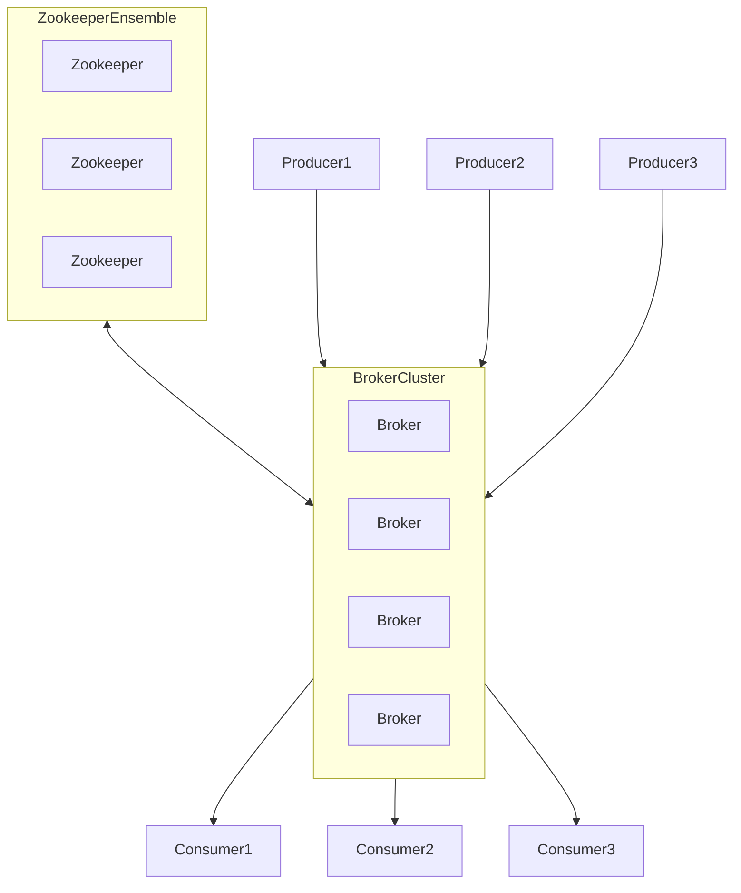

This is an extension of my [2025 Learning Log](). 

> ⚠️ This post is currently a work-in-progress as I am still going through the materials

I started learning Apache Kafka. I wanted to study Flink actually but since it comes downstream of Kafka, I figured I might as well learn a bit more about Kafka first.

I am learning through this course [The Complete Apache Kafka Practical Guide](https://www.udemy.com/course/apache_kafka/). The version used in the videos is a bit older and still uses [Zookeeper](https://zookeeper.apache.org/). So I'm going back and forth between this course and other materials I find in the [official docs](https://kafka.apache.org), the interwebs, and/or YouTube.

Kafka has [been moving away from using Zookeeper](https://www.baeldung.com/kafka-shift-from-zookeeper-to-kraft) and has introduced the KRaft protocol (Kafka Raft Metadata mode). This eliminates the need for Zookeeper, making Kafka simpler to deploy and manage.

## Introduction

Here is an [introduction to Kafka](https://kafka.apache.org/intro) from the [official docs](https://kafka.apache.org).

event 
- an indication in time that the thing took place
- e.g. represents a thing that happened in the business
- stored in topics

log
- structure that stores events (events are not stored in databases)
- ordered sequence of events
- easy to build at scale, easier than databases

Apache Kafka 
- is a system for managing these logs
- think of events first, things second


topics 
- ordered sequence of events stored in a durable way (stored in disc, replicated)
- can store topics for short or long time
- topics can be small or enormous


Programs can talk to each other through Kafka topic. Each program consumes a message from a Kafka topic, do computations (e.g. grouping, filtering, enriching the data from another topic), then produce that message into another separate Kafka topic to be likewise durably stored and processed - e.g. by a new service that perform real-time analysis of the data


[Kafka connect](https://kafka.apache.org/documentation/#connect)
- enables Kafka to connect with other systems using connectors

[Kafka streams](https://kafka.apache.org/documentation/streams/)
- API that handles all framework and infrastructure to process data in Kafka in a scalable and fault-tolerant way


## Installation
There are two ways to [install Kafka](https://kafka.apache.org/quickstart) - using the binary, and from docker.  Using Docker is fairly straight-forward, and no need to manually install or manage a compatible Java version. I tried the steps in this [article](https://developer.confluent.io/confluent-tutorials/kafka-on-docker/) which uses a docker compose file.

I also tried using the binary, which requires a prior installation of Java version 17 and up. My machine defaults to version 11 so had to spend some time linking the approriate version which already exists (in my case version 23).

Here's the rough steps.

Install and unpack

```bash
curl https://dlcdn.apache.org/kafka/4.0.0/kafka_2.13-4.0.0.tgz -o ~/Downloads/kafka.tgz

mkdir kafka
cd kafka
tar -xvzf ~/Downloads/kafka.tgz --strip 1
```

Install Java

```bash
# check java version or if java is present 
java -version

# to install
# use apt install
sudo apt install openjdk-11-jdk
# or use brew install
brew install openjdk@23

```

For existing installation, make sure it's the one being linked when calling the Java binary from the terminal: I used this [Stack overflow](https://stackoverflow.com/questions/69875335/macos-how-to-install-java-17) troubleshooting as reference


```bash

sudo ln -sfn /opt/homebrew/opt/openjdk\@23/libexec/openjdk.jdk /Library/Java/JavaVirtualMachines/openjdk.jdk

export JAVA_HOME=`/usr/libexec/java_home -v 23`

echo 'export PATH="/opt/homebrew/opt/openjdk/bin:$PATH"' >> ~/.zshrc

source ~/.zshrc

java -version
```

Then I followed the rest of the steps in the [installation/ quick start docs](https://kafka.apache.org/quickstart) 

Generate a Cluster UUID

```bash
$ KAFKA_CLUSTER_ID="$(bin/kafka-storage.sh random-uuid)"
```

Format Log Directories

```bash
$ bin/kafka-storage.sh format --standalone -t $KAFKA_CLUSTER_ID -c config/server.properties
```

Start the Kafka Server

```bash
$ bin/kafka-server-start.sh config/server.properties
```


## Creating a Kafka topic

Use the binaries located in the installation folder e.g. `/opt/kafka/bin`. To create a topic, use the script `./kafka-topics.sh`

Both the flags `--bootstrap-server` and `--topic` are required as well as the flag `--create` to denote the action. As I'm not using Zookeeper, will not anymore specify the flag for it, and instead use `bootstrap-server`.

```bash
./kafka-topics.sh --create --bootstrap-server localhost:9092 --topic cities
```

To list existing topics, use the flag `--list`

```bash
./kafka-topics.sh --list --bootstrap-server localhost:9092
```

To show details of a topic, use the flag `--describe`

```bash
./kafka-topics.sh --describe --bootstrap-server localhost:9092
```

output

```text
Topic: cities   TopicId: aQjPyaLhTU-Toc1VxCugYw PartitionCount: 1 ReplicationFactor: 1    Configs: 
        Topic: cities   Partition: 0    Leader: 1Replicas: 1      Isr: 1  Elr:    LastKnownElr: 
```

`ReplicationFactor=1` - only one server will save the topics

To delete a topic, use the flag `--delete` and specify the topic name using `--topic`

```bash
./kafka-topics.sh --delete --topic my-topic --bootstrap-server localhost:9092
```

## Producing and consuming messages

Kafka installation comes with a producer called `kafka-console-producer.sh` which can be used to send messages to a topic

```bash
./kafka-console-producer.sh  --topic cities --bootstrap-server localhost:9092
```

There will be prompts for entering messages, example names of cities

```text
>New York
>Berlin
>Paris
>London
>Sydney
```

Run a consumer. To do so, open another terminal. Use the built in consumer script `kafka-console-consumer.sh` to consume messages from the topic `cities`

```bash
./kafka-console-consumer.sh --bootstrap-server localhost:9092 --topic cities
```

Adding `Delhi` in producer, should return `Delhi` to the consumer. 

```text
Delhi
```

Adding `Dubai` in producer should likewise return `Dubai` to the consumer.

```text
Dubai
```

By default, the consumer will return current messages. To show earlier messages, use the flag `--from-beginning`. This will show the previous cities including the two newly added.

```bash
./kafka-console-consumer.sh --bootstrap-server localhost:9092 --topic cities --from-beginning
```

results

```text
New York
Berlin
Paris
London
Sydney
Delhi
Dubai
```

### Run multiple consumers

Apache Kafka cluster store messages even if they were already consumed by one of the consumers. Same messages maybe read multiple times by different consumers at different moments of time.


Launch another consumer, add `Amsterdam` in producer, should show `Amsterdam` in the *both* consumers.

Multiple consumers and multiple producers could exchange messages via single centralized storage point - Kafka cluster

### Run multiple producers

Launch a new producer and write `Barcelona`  
consumer 1 and consumer 2 should also show `Barcelona`

Producers and consumers don't know about each other. Producers and consumers may appear and disappear. But Kafka doesn't care about that. It's job is to store messages and receive or send them on demand.

Stopping one of the producers will not affect the rest. Likewise, stopping a consumer will not affect the others.

## Where does Kafka store messages

To find out where Kafka store these messages, find the log path in the `server.properties` file
```bash
cat /opt/kafka/config/server.properties
```

```text
...
log.dirs=/tmp/kraft-combined-logs
```

Access the logs directory

```bash
cd /tmp/kraft-combined-logs
```

This would have 50 folders of `__consumer_offsets-<number>` from 0-49. These are 50 partitions by system topic called `__consumer_offsets`

It will also show a folder corresponding to the previously defined topic: `cities-0` is single partition only of the defined topic


```bash
cd cities-0/
ls
cat 00000000000000000000.log
```

Kafka stores messages in this `*.log` file as text

Kafka doesn't store all messages forever and after specific amount of time (or when size of the log exceeds configured max size) messages are deleted.

Default log retention period is 7 days (168 hours)

To show the application logs , go to the `logs` directory, there will be dated logs inside e.g. `/opt/kafka/logs/server.log.2025-03-24-11`

Partitions are spread among all available brokers. Every consumer must belong to a consumer group. Every message inside the topic has unique number called "offset". First message in each topic has offset 0. Consumers start reading messages starting from a specific offset, e.g.


```text
mesagge -------- Offsets
>New York -------- 0
>Berlin ---------- 0
>Paris ----------- 0
>London ---------- 0
>Sydney ---------- 0
```

## Apache Kafka
Apache Kafka is a *distributed publish-subscribe messaging system*. It stores messages created by Producers, and makes them available to Consumers. Producers and Consumers operate independent of one another.

Distributed means it is a fault-tolerant, resilient system with the ability to create large clusters with many different servers; when one or more servers fail, other servers may continue operation to serve publishers and consumers, and when all are set up correctly even one message will not be lost.

## Broker
Producers produce messages to Kafka brokers. Consumers consume messages from Kafka brokers


Broker responsibilities include
- receiving messages from Producers
- storing those messages
- giving ability for consumers to consume those message

Brokers store messages into files, Producers append messages to those files, Consumers are able to read from those files

It's possible to have multiple Producers, and multiple Consumers. Multiple Producers are able to produce multiple messages to Broker, multiple Consumers are able to consume messages from Broker.


Messages may be produced and consumed asynchronously at different moments of time.

For a single broker system, if the broker fails nothing will be able to produce or consume messages - that's why it's best to create broker clusters.

A single Kafka server can run multiple Kafka brokers called a *broker cluster*


Different Producers, and different Consumers are able to interact with different Brokers in the cluster. Every Producer can send messages to different Kafka brokers, and each Kafka broker will store part of the messages - all messages from the Producers will be spread to different servers. Kafka consumers might read messages from different Kafka brokers. If one of the brokers fail, other brokers will take over and continue operation of the clusters.

Zookeeper is responsible for broker synchronization.

## Zookeeper
Also used in Apache Hadoop, Apache Solr


Zookeeper maintains a list of active brokers. It knows, at a given moment, which brokers are active, and which have failed. 

It elects a controller among brokers in a cluster; there's only one controller in each cluster. 

Lastly, it manages configuration of the topics and partitions. When a topic is created in the cluster, it is created in Zookeeper, Zookeeper distributes this configuration to all brokers in the cluster

If the Zookeeper in a single Zookeeper system fails, the whole system will be down. Hence, it is also possible to create a cluster of Zookeepers.

## Zookeeper ensemble



A cluster of Zookeepers is called a *Zookeeper ensemble*.

In every Zookeeper cluster, a quorum should be set. *Quorum* is the minimum quantity of the servers that should be running in order to have an operational cluster. Otherwise, Zookeeper cluster will be down as well as all connected brokers i.e. entire Apache Kafka server will be down as well

It is recommended to have an odd number of servers in Zookeeper ensemble (e.g. 1, 3, 5 , 7 etc) and the quorum set to `(n+1)/2` where n is the quantity of servers. This prevents just half of servers managing an actually broken cluster (example a quorum of 2 of 4 servers hosted in a different zone will keep on working even if the other half of the cluster is already inactive. This leads to broken messages).


## Multiple Kafka clusters

It is possible to setup several clusters of Apache Kafka. To facilitate synchronization (e.g. when clusters are hosted in different zones), setup mirroring between the different clusters. No mirroring creates completely different clusters in different regions


## Default ports of Zookeeper and Broker
The default ports are the following:
- Zookeeper localhost:2181
- Kafka server (broker) localhost:9092

If launching multiple Zookeepers or broker servers in the same computer, assign different ports to each, create different configuration files with different ports, and it's also a good idea to create separate local folders for every instance


e.g. Zookeeper localhost:2181, :2182, :2183
server (broker) localhost:90921, :9093, :9094

If running Zookeepers and Brokers on different computers, there is no need to change ports

If Brokers should be publicly accessible, `advertised.listeners` property in Broker config should be adjusted as localhost is not accessible by outside network.


